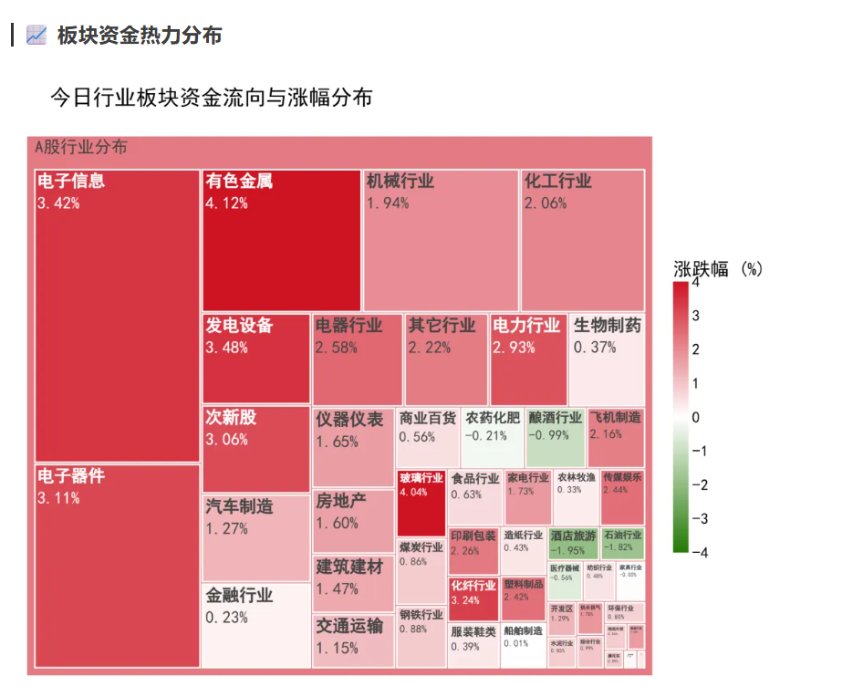
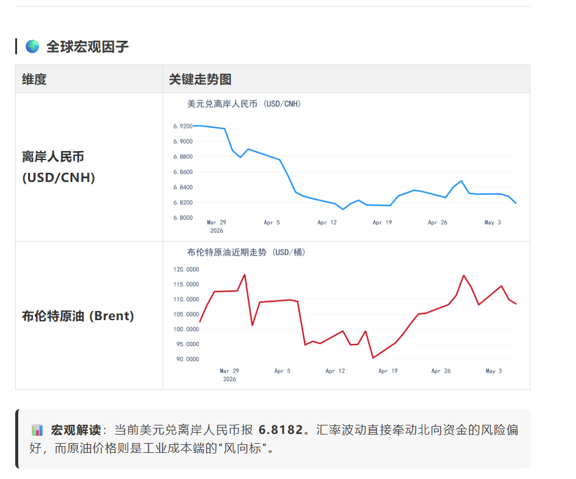
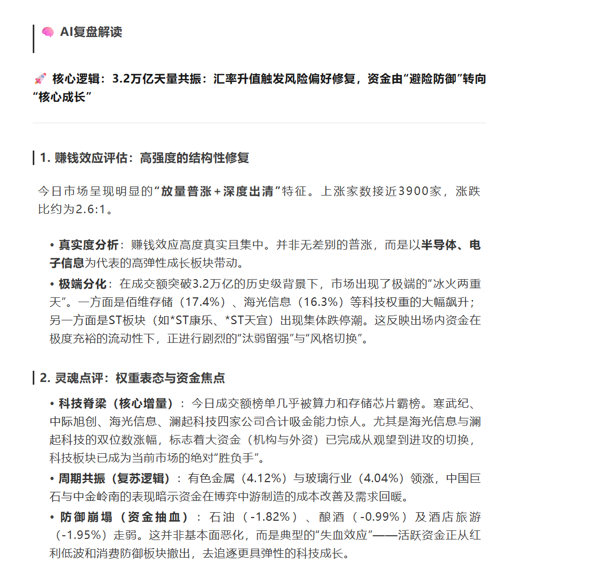

# A股每日复盘自动生成系统

基于 AkShare + Gemini AI 的 A股市场每日复盘报告自动生成工具。

## 功能特性

- **数据采集**：通过 AkShare 获取全市场 A股实时行情和49个一级行业板块数据
- **宏观数据**：支持布伦特原油（yfinance）、美元兑离岸人民币汇率（新浪财经）趋势分析
- **AI 分析**：调用 Google Gemini 生成专业市场复盘，包含宏观环境、行业纵览、个股异动等多维视角
- **数据蒸馏**：从5500+只个股中智能提取涨幅榜、跌幅榜、成交额榜核心情报
- **全球估值**：巴菲特指标计算（中美国市场总市值/GDP对比）
- **可视化**：行业热力图（Treemap）+ 宏观走势图
- **报告生成**：Markdown 格式日报，支持缓存机制避免重复请求

## 效果展示





## 目录结构

```
AShareDailyReport/
├── main.py                 # 主入口
├── src/
│   ├── collector.py       # 数据采集（AkShare + yfinance + 新浪财经）
│   ├── analyst.py          # AI 分析（Gemini）
│   ├── visualizer.py       # 图表生成（Plotly）
│   └── settings.py         # 配置管理
├── templates/
│   └── report_template.md  # 报告模板
├── tests/                  # 测试脚本
├── data/cache/             # 数据缓存目录
├── output/                 # 生成的报告输出目录
└── requirements.txt       # 依赖列表
```

## 环境配置

### 1. 安装依赖

```bash
pip install -r requirements.txt
```

### 2. 配置环境变量

复制 `.env.example` 为 `.env`，并填入你的配置：

```bash
cp .env.example .env
```

编辑 `.env` 文件：

```env
GOOGLE_API_KEY=your-google-api-key-here
GOOGLE_MODEL_ID=gemini-2.0-flash
GEMINI_PROXY=http://127.0.0.1:7890
```

## 使用方法

### 运行主程序

```bash
python main.py
```

生成的报告保存在 `output/A股深度复盘_{日期}.md`

### 运行测试

```bash
# 测试各数据接口
python tests/akshare_test.py
python tests/akshare_forex_test.py
python tests/ai_model_list_test.py
```

## 数据缓存

数据按日期分类存储在 `data/cache/{日期}/` 目录下：

| 文件 | 说明 |
|------|------|
| `raw_market.csv` | 市场原始数据 |
| `raw_industries.csv` | 行业板块数据 |
| `fx_data.csv` | 汇率数据 |
| `oil_data.csv` | 原油数据 |
| `hotmap.png` | 行业热力图 |
| `fx.png` | 汇率走势图 |
| `oil.png` | 原油走势图 |
| `ai_review.txt` | AI复盘缓存 |

## 数据来源

| 数据类型 | 数据源 | 说明 |
|----------|--------|------|
| A股行情 | AkShare (东方财富) | 全市场实时行情 |
| 行业板块 | AkShare (新浪财经) | 49个一级行业板块 |
| 布伦特原油 | yfinance (Yahoo Finance) | BZ=F 连续合约 |
| 离岸人民币 | AkShare (新浪财经) | USD/CNH 日K线 |
| AI 分析 | Google Gemini | 专业市场复盘 |

## 巴菲特指标

系统自动计算中美国市场巴菲特指标（市值/GDP）：

| 市场 | 数据来源 |
|------|----------|
| A股总市值 | efinance |
| 美股总市值 | yfinance (^GSPC + ^IXIC + Russell 2000) |
| 中国GDP | 140.19 万亿 CNY (2025年名义GDP) |
| 美国GDP | 30.77 万亿 USD (2025年名义GDP) |

## 报告模板

编辑 `templates/report_template.md` 可自定义报告格式。

## 依赖列表

- `google-genai` - Gemini API
- `akshare` - A股和行业数据源
- `efinance` - 中国股市总市值
- `yfinance` - 原油和美股数据源
- `requests` - HTTP 请求
- `pandas` - 数据处理
- `plotly` - 数据可视化
- `jinja2` - 模板渲染
- `python-dotenv` - 环境变量管理
